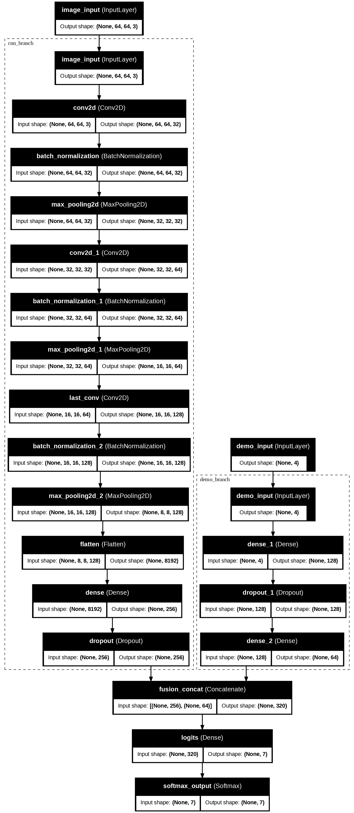
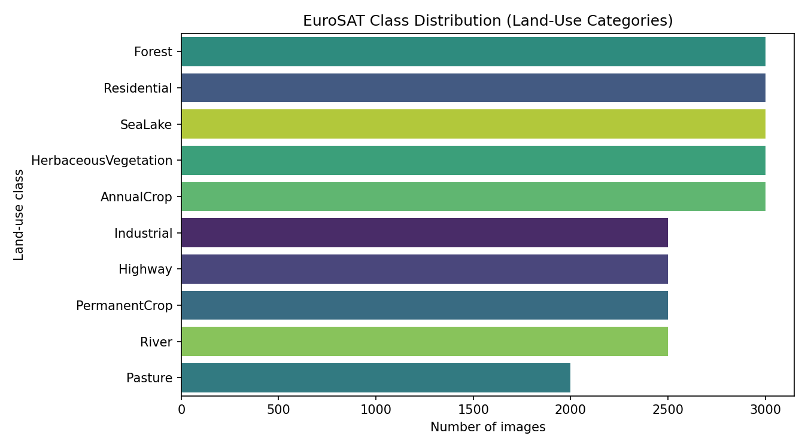
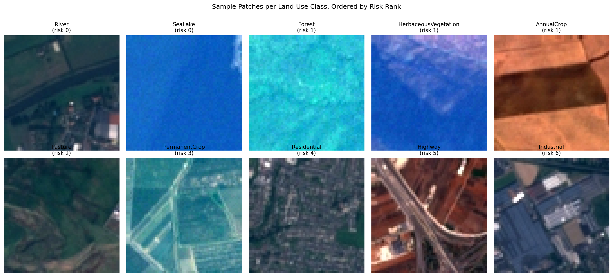
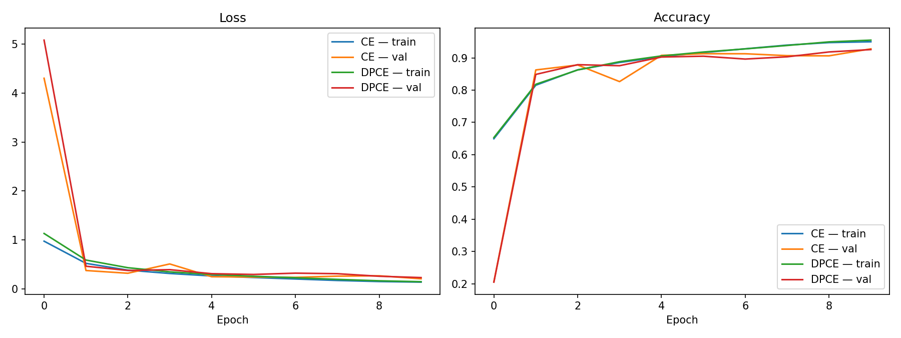
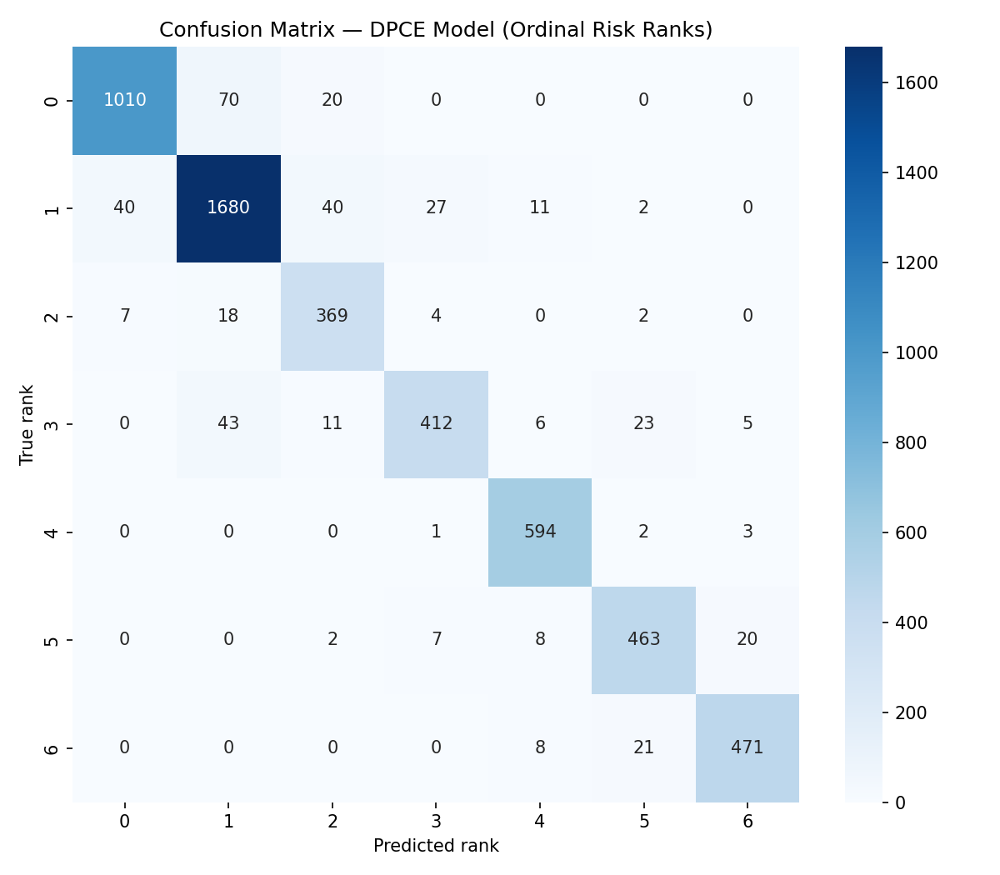
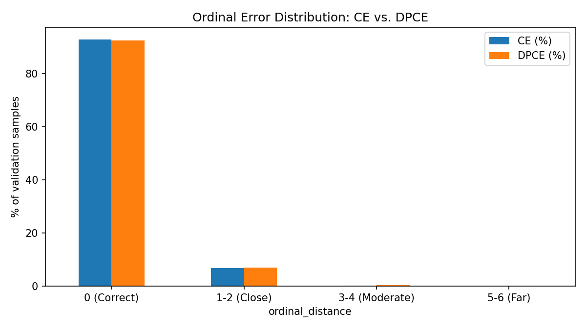
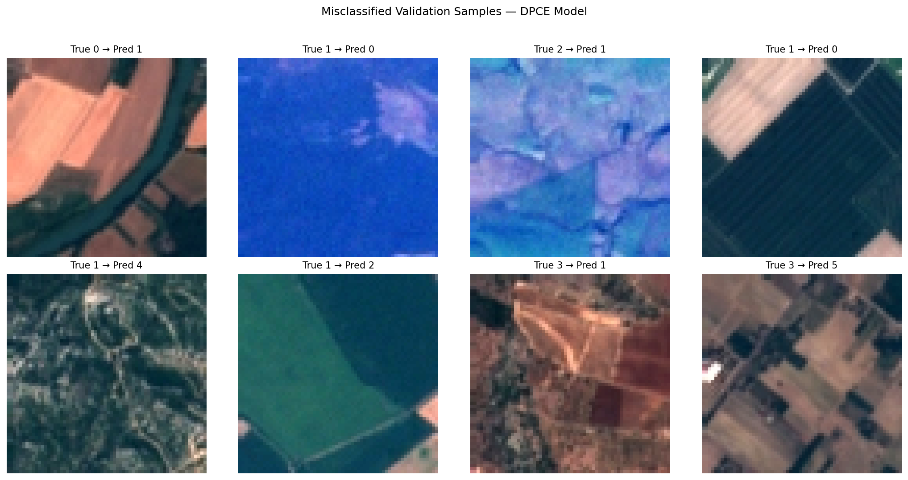
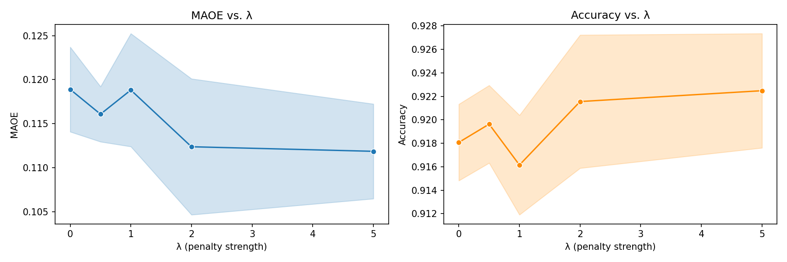
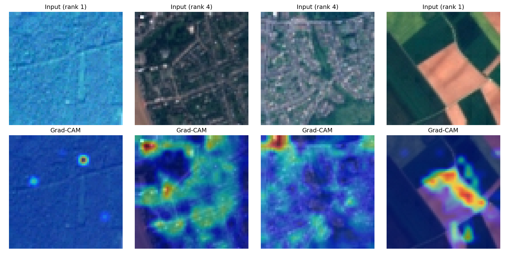
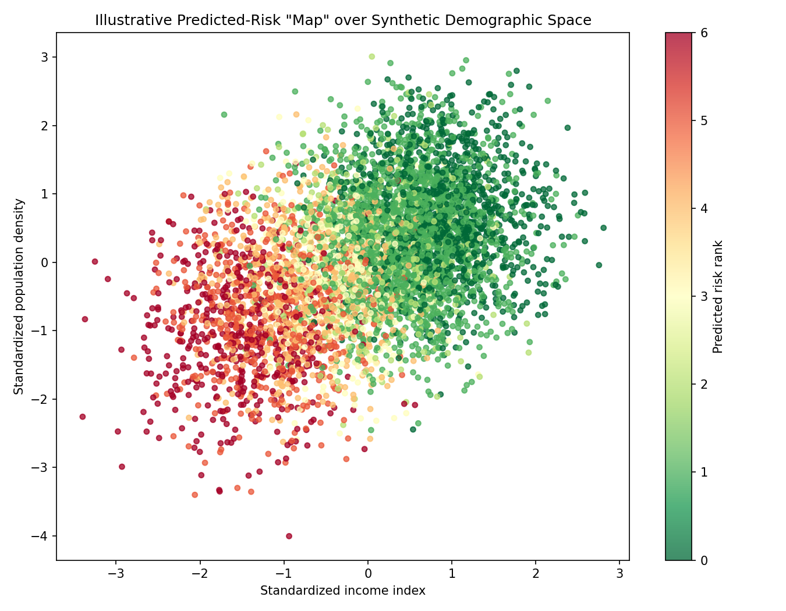

<div align="center">

# 🌍 DeepEnMap

### Multi-Modal Deep Learning for Ordinal Energy Poverty Risk Mapping

[](https://www.python.org/)
[](https://www.tensorflow.org/)
[](LICENSE)
[]()

*Fusing satellite imagery and demographic data to map energy poverty risk — with an ordinal-aware learning objective.*

</div>

---

## 📖 Overview

**DeepEnMap** is a multi-modal deep learning framework that predicts **energy poverty risk** by combining satellite imagery with demographic data. 

Most risk-mapping approaches treat class prediction as a purely nominal classification problem — every wrong answer counted as equally wrong. DeepEnMap instead recognizes that risk levels are **ordinal**: mistaking a moderate-risk region for a slightly-higher-risk one is a minor error, while mistaking a severe-risk region for a low-risk one is a serious error with real consequences for resource allocation.

To address this, the framework uses a custom **ordinal-aware loss function** that penalizes distant misclassifications more heavily than nearby ones, paired with a companion **ordinal-error evaluation metric** to track how well this is working — going beyond what plain accuracy can tell you.

<div align="center">



*Figure 1 — DeepEnMap architecture: satellite imagery is processed through a CNN branch while demographic data flows through a dense branch; both feature sets are fused and passed to the final classifier.*

</div>

---

## 📦 Dataset

This project uses the **[EuroSAT RGB](https://www.kaggle.com/datasets/apollo2506/eurosat-dataset)** dataset (via `kagglehub`, dataset ID `apollo2506/eurosat-dataset`) — Sentinel-2 satellite imagery patches covering 10 land-use/land-cover classes across Europe.

Since EuroSAT does not natively include energy poverty labels, ordinal risk levels used in this project are derived synthetically to demonstrate the modeling framework, and demographic features are paired with imagery for the multi-modal fusion setup. The dataset is not included in this repository — running the code will automatically download it via `kagglehub`.

```python
import kagglehub
dataset_path = kagglehub.dataset_download("apollo2506/eurosat-dataset")
```

---

## 📑 Table of Contents

- [Dataset](#-dataset)
- [Key Contributions](#-key-contributions)
- [Pipeline](#-pipeline)
- [Data Visualization](#-data-visualization)
- [Results](#-results)
- [Ablation Studies](#-ablation-studies)
- [Computational Cost](#-computational-cost)
- [Explainability](#-explainability)
- [Repository Structure](#-repository-structure)
- [Requirements](#-requirements)
- [Citation](#-citation)
- [About the Developer](#-about-the-developer)

---

## ✨ Key Contributions

| | |
|---|---|
| 🎯 **Ordinal-Aware Loss** | Penalizes probability mass placed on ordinally distant wrong classes more heavily than on nearby ones — a strict, backward-compatible generalization of standard cross-entropy. |
| 📏 **Ordinal-Error Metric** | Captures *how far* predictions deviate from ground truth (in risk-level steps), not just whether they are right or wrong. |
| 🔗 **Multi-Modal Fusion** | A convolutional branch over satellite patches fused with a dense demographic encoder, jointly trained end-to-end. |
| 🔍 **Grad-CAM Explainability** | Saliency maps aligned with the ordinal-aware training objective, for interpretable risk predictions. |

---

## ⚙️ Pipeline

| Stage | Name | Function |
|:---:|---|---|
| 1 | **Data Preprocessing** | Normalizes satellite patches, standardizes demographic features, one-hot encodes labels, 80/20 train-validation split |
| 2 | **Spatial Feature Extraction (CNN)** | 3-block convolutional network extracting a 256-dimensional feature vector from satellite imagery |
| 3 | **Multi-Modal Fusion & Classification** | Concatenates image and demographic features, predicts class probabilities across 7 ordinal risk levels |
| 4 | **End-to-End Training** | Adam optimizer with early stopping |

---

## 🗂️ Data Visualization

<div align="center">




*Left: distribution of samples across the 7 ordinal risk classes. Right: representative satellite patches per class.*

</div>

---

## 📊 Results

Models were trained across multiple random seeds with early stopping. Results reported as mean ± standard deviation.

| Loss Function | Accuracy | Ordinal Error ↓ | F1 (macro) |
|---|:---:|:---:|:---:|
| Standard Cross-Entropy | 0.9157 ± 0.0099 | 0.1229 ± 0.0151 | 0.9096 ± 0.0105 |
| **Ordinal-Aware Loss (ours)** | **0.9166 ± 0.0092** | **0.1201 ± 0.0130** | **0.9102 ± 0.0104** |

> The proposed loss matches standard cross-entropy on accuracy while reducing ordinal error — meaning that when the model *is* wrong, it tends to be wrong by a smaller margin.

<div align="center">




*Training/validation curves (left) and confusion matrix (right) — most confusions fall on adjacent risk classes, consistent with the ordinal structure the loss is designed to exploit.*




</div>

---

## 🧪 Ablation Studies

### Modality Ablation

| Modality | Accuracy | Ordinal Error ↓ | F1 (macro) | Parameters |
|---|:---:|:---:|:---:|:---:|
| Demographic only | 0.5827 ± 0.0061 | 0.4829 ± 0.0083 | 0.4780 ± 0.0096 | 9,351 |
| Image only | 0.8593 ± 0.0033 | 0.3280 ± 0.0146 | 0.8503 ± 0.0029 | 2,193,351 |
| **Multi-modal (fused)** | **0.9166 ± 0.0092** | **0.1201 ± 0.0130** | **0.9102 ± 0.0104** | 2,202,695 |

> Fusing both modalities substantially outperforms either alone — demographic data adds meaningful signal despite contributing less than 0.5% of total parameters.

### Sensitivity Analysis

<div align="center">



</div>

Statistical significance across penalty-strength settings was assessed using paired t-tests with Holm–Bonferroni correction against the baseline. The strongest setting achieved statistically significant improvements in both accuracy and ordinal error.

---

## ⚡ Computational Cost

| Modality | Parameters | FLOPs / Inference |
|---|:---:|:---:|
| Demographic only | 9,351 | 18,538 |
| Image only | 2,193,351 | 87,692,394 |
| Multi-modal (fused) | 2,202,695 | 87,710,890 |

> The demographic branch adds under 0.1% computational overhead relative to the image branch — multi-modal fusion is essentially "free" in inference cost while delivering the largest performance gains.

---

## 🔍 Explainability

Grad-CAM saliency maps are computed with respect to the proposed loss, so the highlighted regions reflect the ordinal-aware training objective rather than a distance-agnostic one.

<div align="center">




**Spatial Risk Predictions**



</div>

---

## 📁 Repository Structure

```
DeepEnMap/
├── Images/                          # All figures used in this README
│   ├── 01_class_distribution.png
│   ├── 02_sample_grid.png
│   ├── 03_model_architecture.png
│   ├── 04_training_history.png
│   ├── 05_confusion_matrix.png
│   ├── 06_misclassified_examples.png
│   ├── 07_gradcam_heatmaps.png
│   ├── 08_country_prediction_map.png
│   └── gradcam_samples.png
├── codes/
│   ├── DeepEnMap_Experiments.ipynb        # Full experiment notebook
│   ├── DeepEnMap_Experiments.ipynb - Colab.pdf
│   └── deepenmap_experiments.py           # Script version
├── Experiment_1/                    # Baseline vs. proposed loss comparison
├── Experiment_2/                    # Sensitivity sweep + significance tests
├── Experiment_3/                    # Modality ablation
├── Experiment_4/                    # Ordinal error distribution analysis
├── requirements.txt
├── LICENSE
├── CITATION.cff
├── .gitignore
└── README.md
```

---

## 🛠️ Requirements

- Python 3.x
- TensorFlow 2.15
- Keras

All experiments were run on a single NVIDIA T4 GPU (16 GB VRAM) via Google Colaboratory.

Install dependencies with:

```bash
pip install -r requirements.txt
```

> **Note:** The notebook assumes a Google Colab environment; the `google.colab` import can be removed for local runs.

---

## 📜 Citation

If you use this work, please cite:

```bibtex
@article{deepenmap2026,
  title={DeepEnMap: A Multi-Modal Deep Learning Framework for Energy Poverty Risk Mapping},
  author={Ahmed, Sarder Junaid},
  year={2026}
}
```

A machine-readable citation is also available via [`CITATION.cff`](CITATION.cff).

---

## 👨‍💻 About the Developer

<div align="center">


### Sarder Junaid Ahmed
**Data Scientist & Machine Learning Engineer**

*Transforming complex data into strategic decisions through rigorous statistical modeling and production-ready machine learning systems.*

[](https://github.com/Junaid-Ahmed-Rupok)
[](https://www.linkedin.com/in/sarder-junaid-ahmed-059b68240/)
[](https://junaid-ahmed-rupok.github.io/__portfolio__Yes/)
[](mailto:junaidahmedrupok@gmail.com)

</div>

**Specializations:** Statistical ML · Causal Inference · Trustworthy AI · Fairness-Aware ML · RAG Systems

**Selected Research:**
- 📄 **Ahmed, S.J.** et al. (2026). *Machine Learning for Crime Classification: A Fairness-Aware Approach to Class Imbalance.* Journal of Machine Learning and Applications, 2(1), 9–17. [DOI: 10.61577/jmla.2026.100002](https://doi.org/10.61577/jmla.2026.100002)
- 📄 **Ahmed, S.J.** et al. (2026). *CF-EGAT: A Causal Fairness-Aware Equity Graph Attention Network for Country-Level Environmental Livability Classification.* SPECTRA 2026. 🏆 **1st Best Paper Award**
- 📄 **Ahmed, S.J.** (2025). *Multi-Dimensional Statistical Similarity for Governance Classification: Beyond Arbitrary Thresholds.* APMEE 2025. 🏆 **Best Research Paper Award**
- 📄 **Ahmed, S.J.** (2026). *DeepEnMap: Ordinal-Aware Multi-Modal Deep Learning for Energy Poverty Risk Mapping.* IEMIS 2026, University of British Columbia, Vancouver, Canada (Aug 10–12, 2026). **Accepted for Presentation** — Springer LNNS Series (Scopus, EI-Compendex, DBLP, ISI Proceedings).
- 📄 **Ahmed, S.J.** (2026). *Density-Decoupled, Mask-Ablated Segmentation-Guided Diffusion for Controllable Mammography Synthesis: A Preliminary Study.* IEMIS 2026, University of British Columbia, Vancouver, Canada (Aug 10–12, 2026). **Accepted for Presentation** — Springer LNNS Series (Scopus, EI-Compendex, DBLP, ISI Proceedings).
- 📄 **Ahmed, S.J.**, Islam Nahian, M.T., Kwoshik, M.H.R., & Nakib, F.N. (2025). *Environmental Livability Assessment via Adaptive Bootstrap-Retrained SHAP and Statistically-Constrained Pareto Counterfactuals: A Cross-National Analysis.* **Under Review**, IEEE SPICSCON 2026.
- 📄 **Ahmed, S.J.** (2026). *FAI: Feature-Wise Adaptive Imputation via Downstream-Aware Method Selection.* **Under Review**, ICISET 2026 (IEEE Xplore).

**Other Deployed Projects:**
- 🔬 [ReproHub](https://reproapp-8jb7vbhnqyltxq23bsr8xn.streamlit.app/) — Automated research reproducibility platform with composite scoring across 11 statistical tests
- 📊 [StatsPro](https://statistical-analysis-app-7axetqtx75ncuu7fr8irxj.streamlit.app/) — AI-powered statistical analysis platform with automated CSV-to-report workflows
- 🤖 [Smart RAG Chatbot](https://github.com/Junaid-Ahmed-Rupok/smart-rag-chatbot) — Document Q&A chatbot with cited retrieval, powered by Groq + FAISS + LangChain

**Honors:**
🏆 1st Best Paper — SPECTRA 2026 &nbsp;·&nbsp;
🏆 Best Research Paper — APMEE 2025 &nbsp;·&nbsp;
🎖️ Esteemed Alumni Award — YLRL RUET 2024 &nbsp;·&nbsp;
⭐ Perfect GPA 5.00/5.00 — SSC & HSC &nbsp;·&nbsp;
🎓 National Merit Scholarship — 2009 & 2013

---

<div align="center">

## 📄 License

MIT — see [LICENSE](LICENSE).

</div>
```
